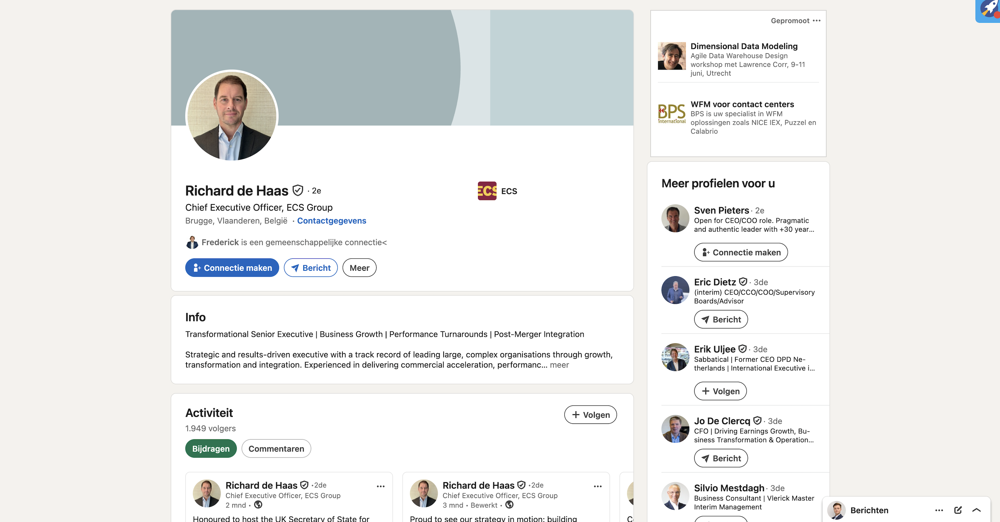
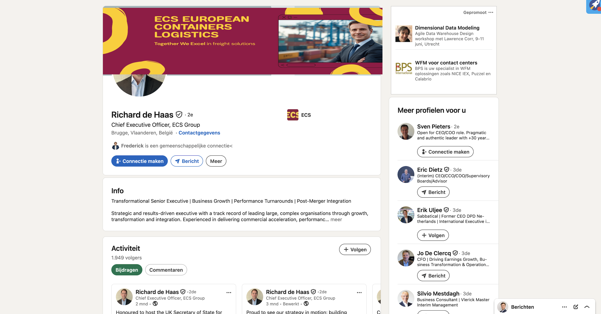

<div align="center">

# ECS European Containers — Digital Presence Audit

**Scope:** ecs.be · LinkedIn (company + CEO) · Customer Portals · Legal & Compliance  
**Method:** Manual review · curl/HTTP inspection · page source analysis · LinkedIn data  
**Date:** June 2026 · **Author:** Philippe Godfroy

</div>

---

## Summary

| # | Finding | Area | Severity | Fix Effort |
|---|---------|------|----------|------------|
| 1 | Supply Chain Portal completely dead (DNS NXDOMAIN) | Broken functionality | 🔴 Critical | Low |
| 2 | Both customer portals use HTTP, not HTTPS | Security | 🟠 High | Low |
| 3 | T&C: no click-wrap, UK carrier doc 14 months old | Legal | 🟠 High | Medium |
| 4 | GDPR: advertising cookies fire without consent category | Compliance | 🟠 High | Low |
| 5 | 3 different company names in use: "ECS Group" / "European Containers" / "Intermodal Supply Chain" | Brand consistency | 🟡 Medium | Low |
| 6 | Website links to old LinkedIn URL (301 redirect, never updated after rebrand) | Brand consistency | 🟡 Medium | Trivial |
| 7 | CEO LinkedIn: default abstract banner, no ECS brand — 1,949 followers see nothing | Brand | 🟡 Medium | Trivial |
| 8 | ECS active on 2 social channels vs. 4–5 industry standard | Marketing | 🟡 Medium | Medium |
| 9 | All T&C PDFs publicly indexable via guessable paths | Info disclosure | 🟢 Low | Low |

---

## 1. 🔴 Critical — Broken Customer Portal

**Page:** [ecs.be/nl/mijn-portaalsites](https://www.ecs.be/nl/mijn-portaalsites)

The portal page lists two customer-facing links:

| Portal | URL | Status |
|--------|-----|--------|
| Intermodal Transport Portal | `http://customerportal-intermodal.ecs.be` | ✅ Reachable |
| Supply Chain Portal | `http://customerportal-supplychain.ecs.be` | 🔴 **Dead** |

```bash
$ curl -o /dev/null -s -w "%{http_code}" http://customerportal-supplychain.ecs.be
000   ← no connection at all (DNS_PROBE_FINISHED_NXDOMAIN)
```

**Root cause:** `customerportal-supplychain.ecs.be` has no DNS record — the subdomain was decommissioned without updating the link on ecs.be.

**Impact:** A customer or new prospect clicks "Supply Chain Portal" and hits a blank browser error. No fallback, no redirect, no message from ECS. For a company positioning itself as a supply chain partner, this is the first thing a prospect might click after reading the services page.

**Fix:** Update the link to the current portal URL or set a DNS redirect.

---

## 2. 🟠 High — Customer Portals Served Over HTTP

Both portal links on the ECS website use `http://` — not `https://`:

```
http://customerportal-intermodal.ecs.be
http://customerportal-supplychain.ecs.be
```

Customer portal sessions — login, shipment data, track & trace — transmitted over unencrypted HTTP are vulnerable to interception. Modern browsers flag HTTP login pages with a prominent "Not secure" warning, which actively undermines trust at the login screen.

**Fix:** Force HTTPS on both subdomains. Update the links on ecs.be.

---

## 3. 🟠 High — Terms & Conditions: No Click-Wrap, Outdated UK Document

**Page:** [ecs.be/nl/algemene-voorwaarden](https://www.ecs.be/nl/algemene-voorwaarden)

### 3a. No click-wrap acceptance

All six T&C documents are plain PDF downloads with no acceptance mechanism:

```
❌ No checkbox ("I have read and accept the terms")
❌ No confirmation step before download
❌ No logged acceptance timestamp
✅ PDF freely accessible to anyone, accepted or not
```

Without click-wrap, proving in a dispute that a customer accepted the current version of the T&C is significantly harder under both Belgian and UK contract law.

### 3b. Document version matrix

| Stakeholder | Entity | Last Updated | Status |
|-------------|--------|--------------|--------|
| Customer | ECS NV / 2XL NV | Sep 2025 | ✅ |
| Customer | ECS Trucking BV | Aug 2025 | ✅ |
| Customer | 2XL France SAS | Aug 2025 | ✅ |
| Supplier & Contractor | ECS NV / 2XL NV | Sep 2025 | ✅ |
| Transport Carrier (non-UK) | ECS NV / 2XL NV | Aug 2025 | ✅ |
| Transport Carrier (UK) | ECS NV / 2XL NV | **Jul 2024** | ⚠️ 14 months old |

The UK carrier T&C has not been updated since July 2024. The UK's Road Haulage Association issued updated guidance on post-Brexit cabotage rules and HMRC import procedures in late 2024 and early 2025. A document predating these changes may no longer reflect current ECS obligations toward UK transport carriers.

**Fix:** Add click-wrap per document group. Review the UK carrier T&C against current HMRC/RHA guidance and update.

---

## 4. 🟠 High — GDPR Cookie Consent Gap

**Source:** Page source of ecs.be — `eu_cookie_compliance` configuration block

### What the cookie banner shows users

The consent popup presents **two** categories:

- ✅ Functionele en statistische cookies *(required, pre-ticked)*
- ☐ Analytische cookies *(optional opt-in)*

### What the configuration actually loads

From the `allowed_cookies` field in the page source:

```
functional:    BIGipServer, lang, _Ifa, Iissc
analytics:     _ga, _gid, _gat, hubspotutk, nQ_cookieID (Leadfeeder)
advertisement: _fbp (Facebook pixel), fr (Facebook), bscookie (LinkedIn), mc
social_media:  lidc (LinkedIn Insight Tag), tr
```

**The gap:** `advertisement` and `social_media` cookies — including the **Facebook pixel** (`_fbp`) and **LinkedIn Insight Tag** (`lidc`) — are defined in the configuration but have **no corresponding consent category in the UI**. A visitor who accepts only functional cookies, or only analytics cookies, is not presented with an advertising opt-in — yet advertising cookies are mapped to those categories.

Under GDPR Art. 6(1)(a) and the ePrivacy Directive, advertising and social tracking cookies require explicit, informed, unambiguous opt-in consent. The current setup does not provide that.

Additional observation: the cookie policy version field in the page source reads `"cookie_policy_version":"1.0.0"` — suggesting the policy has never been formally versioned or updated since launch.

**Fix:** Add an "Advertentie & Social Media" category to the banner. Gate `_fbp`, `lidc`, `bscookie`, `fr` behind it. Increment the policy version on each update.

---

## 5. 🟡 Medium — LinkedIn Brand Name Inconsistency

**Finding:** ECS operates under **three different names** across its own channels simultaneously.

| Channel | Name used |
|---------|-----------|
| ecs.be website | ECS European Containers |
| LinkedIn company URL (old, still linked from site) | `ecs-european-containers` → 301 redirect |
| LinkedIn company page (current) | ECS Intermodal Supply Chain |
| CEO LinkedIn profile title | **ECS Group** |

Three names, zero consistency. A prospect who visits the website, then searches LinkedIn, then clicks the CEO profile encounters a different company name at every step.

The old LinkedIn URL (`linkedin.com/company/ecs-european-containers`) issues a **301 permanent redirect** to `linkedin.com/company/ecs-intermodal-supply-chain`. The ECS website footer still links to the old URL — which works via redirect, but signals the website was never updated after the rebrand.

**Fix:** Decide on a canonical brand name and apply it across website, LinkedIn company page, CEO profile, and all executive profiles. Update the footer link to the current LinkedIn URL.

---

## 6. 🟡 Medium — CEO LinkedIn: No Brand Presence

**Profile:** [linkedin.com/in/richarddehaas](https://www.linkedin.com/in/richarddehaas/)  
**Role:** CEO, ECS European Containers / ECS Intermodal Supply Chain

### Before — Current state



The CEO's profile carries LinkedIn's **default abstract grey-teal background** — no ECS logo, no brand colour, no tagline, no visual identity. His title reads **"Chief Executive Officer, ECS Group"** — a third name variant that appears on no other ECS channel (see finding #5).

With **1,949 followers**, every recruiter, customer, investor, or partner who lands here encounters a completely unbranded executive profile.

### After — With ECS branded banner applied



*Colours: `#8D1D45` (ECS burgundy) · `#F8CE3E` (ECS gold) · "Together We Excel in freight solutions"*  
*Banner designed and mocked up as part of this audit. Design effort: **15 minutes**. Zero budget.*

---

## 7. 🟡 Medium — Social Media: Two Channels Active

ECS footer links two channels:

| Platform | Handle | Followers | Activity |
|----------|--------|-----------|----------|
| LinkedIn | [ECS Intermodal Supply Chain](https://www.linkedin.com/company/ecs-intermodal-supply-chain) | 8,471 | ✅ Active (~1–2× / week) |
| Facebook | [ECS.TogetherWeExcel](https://www.facebook.com/ECS.TogetherWeExcel) | — | ✅ Active |
| Instagram | — | ❌ Not present | — |
| YouTube | — | ❌ Not present | — |
| Twitter / X | — | ❌ Not present | — |

### What's being posted (LinkedIn)

The existing LinkedIn content mix is solid:
- Job openings (Teamlead Credit Collection, driver recruitment)
- Fleet investments (10 new MAN trucks)
- Industry events (Food & Drink Expo Birmingham)
- Educational partnerships (Howest transport degree)
- Community initiatives (Miles for Smiles relay run, THOR safety campaign)

### What's missing

Port and intermodal logistics content performs exceptionally on **Instagram** and **YouTube** — crane operations, Super Mega Trailer loading sequences, Zeebrugge footage, time-lapses, Brexit customs explainers. ECS already has the location, the equipment, and the stories. It's a production gap, not a content gap.

With 863 employees and active recruitment, a YouTube channel ("A day at ECS", "What is a Super Mega Trailer?", "How ECS handles Brexit customs in 90 seconds") directly supports employer branding — a stated priority on the ECS careers page.

**Fix:** Instagram: repurpose existing photos — low effort, high reach. YouTube: one quarterly format to start.

---

## 8. 🟢 Low — T&C PDFs Fully Indexable

The `robots.txt` on ecs.be does not disallow `/sites/default/files/`:

```robotstxt
User-agent: *
Disallow: /admin/
Disallow: /core/
Disallow: /user/login
# ← /sites/default/files/ is NOT disallowed
```

All T&C documents are served from date-embedded paths:

```
/sites/default/files/2025-09/general_conditions_ecs_nv_2xl_nv_customer_nl_2.pdf
/sites/default/files/2025-08/general_conditions_ecs_trucking_bv_nl.pdf
/sites/default/files/2024-07/general_conditions_ecs_nv_2xl_nv_carrier_uk_eng.pdf
```

The predictable naming convention makes all historical document versions guessable by any search engine or researcher. Combined with the absence of versioning in the filenames, it's impossible to know from the URL alone whether a given document is current or superseded.

**Fix:** Add `Disallow: /sites/default/files/` to robots.txt if internal files should not be indexed. Serve T&C from a stable versioned URL (`/terms/customer/current`) and redirect old paths.

---

## Methodology

```bash
# Verify broken portal — confirms DNS NXDOMAIN
curl -o /dev/null -s -w "%{http_code}" http://customerportal-supplychain.ecs.be
# → 000

# Check portal HTTP/HTTPS
curl -I http://customerportal-intermodal.ecs.be | grep -i "location\|strict-transport"

# Inspect ECS main site headers
curl -IL https://www.ecs.be/nl | grep -i "strict-transport\|content-security\|x-frame"

# Retrieve T&C page links
curl -s https://www.ecs.be/nl/algemene-voorwaarden | grep -oP 'href="[^"]*\.pdf"'

# LinkedIn URL redirect check
curl -I https://www.linkedin.com/company/ecs-european-containers/ | grep -i location
# → 301 to /company/ecs-intermodal-supply-chain

# GDPR config: extracted from eu_cookie_compliance JSON in ecs.be page source
# → allowed_cookies field shows advertisement + social_media categories
# → popup config shows only functional + analytics categories in UI

# robots.txt
curl https://www.ecs.be/robots.txt
```

---

## Related: Solutions I Already Built for ECS

Auditing ECS's digital ecosystem naturally led to understanding their operations — which led to building tools designed to run **directly on ECS's existing infrastructure** (TAS terminal system, Microsoft Business Central, Azure).

| Project | What it does | Stack | Live |
|---------|-------------|-------|------|
| [**eco-match-engine**](https://github.com/KippieG/eco-match-engine) | Eliminates empty return mileage by AI-matching open trips across ECS's network. Integrates with TAS + Business Central. Estimated 15–25% reduction in empty km per route. | Python · FastAPI · Power Platform | [delay-dna.vercel.app](https://delay-dna.vercel.app) |
| [**delay-dna**](https://github.com/KippieG/delay-dna) | Predicts shipment delays hours or a full day before they materialise — combining weather, ferry schedules, customs hold patterns, and historical delay data per route. Planners see risks before they become problems. | React · Node.js · ML | [delay-dna.vercel.app](https://delay-dna.vercel.app) |
| [**ecs-ecoload**](https://github.com/KippieG/ecs-ecoload) | Super Mega Trailer load optimizer (DDD + ConsolidationEngine), live reefer container monitoring via SignalR WebSocket, Brexit customs document validator. | .NET 10 · Angular 17 · DDD · Docker | localhost |

---

<div align="center">

**Philippe Godfroy** · [philgodf@gmail.com](mailto:philgodf@gmail.com)  
[github.com/KippieG](https://github.com/KippieG)

</div>
